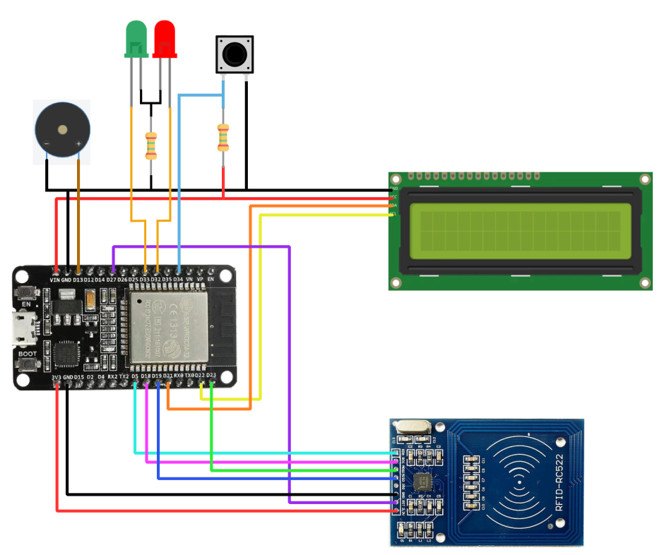

# Smart Parking

Smart Parking is the combination of technologies, such as sensors, cameras, and an information infrastructure, to optimize the use of parking spaces, guide drivers to available spaces, and improve the parking experience. The concept of Smart Parking is a component of Smart Cities, utilizing technology to enhance the efficiency of public parking, reduce traffic congestion, and improve urban mobility. In this project, a prototype of Smart Parking is presented, capable of demonstrating its functionality on a small scale. The implementation of the prototype involves installing sensors on each parking space to detect the presence of vehicles and send real-time information to a central control system. Users can reserve a parking space in advance using their mobile devices through a developed web application. The collected data is utilized to direct drivers to available spaces and manage vehicle flow efficiently.

## Demo Video

## Client Application

Access the client application here: [Smart Parking Client](https://smart-parking-client.vercel.app/)

## Admin Application

Access the admin application here: [Smart Parking Admin](https://smart-parking-admin.vercel.app/)

## Repositories

- Main server repository: [smart-parking-server](https://github.com/Rodrigodcs/smart-parking-server)
- Client Front-end repository: [smart-parking-client](https://github.com/Rodrigodcs/smart-parking-client)
- Admin Front-end repository: [smart-parking-admin](https://github.com/Rodrigodcs/smart-parking-admin)
- Entrance device code repository: [smart-parking-entrance-device](https://github.com/Rodrigodcs/smart-parking-entrance-device)
- Parking spots device code repository: [smart-parking-spots-device](https://github.com/Rodrigodcs/smart-parking-spots-device)

## General Project Flowchart

## Database Schema

## Request Diagram of System Components

## Schematic Diagram of the Electronic Circuitry (Entrance Device)

## Schematic Diagram of the Electronic Circuitry (Parking Spots Device)

Note: Replace the placeholder URLs (example.com/demo-thumbnail.png, example.com/flowchart.png, etc.) with the actual URLs of the images you want to include in the README file. Additionally, ensure that the image URLs are publicly accessible for users to view.

